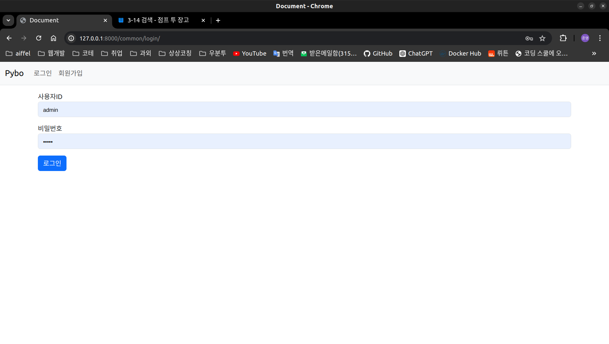
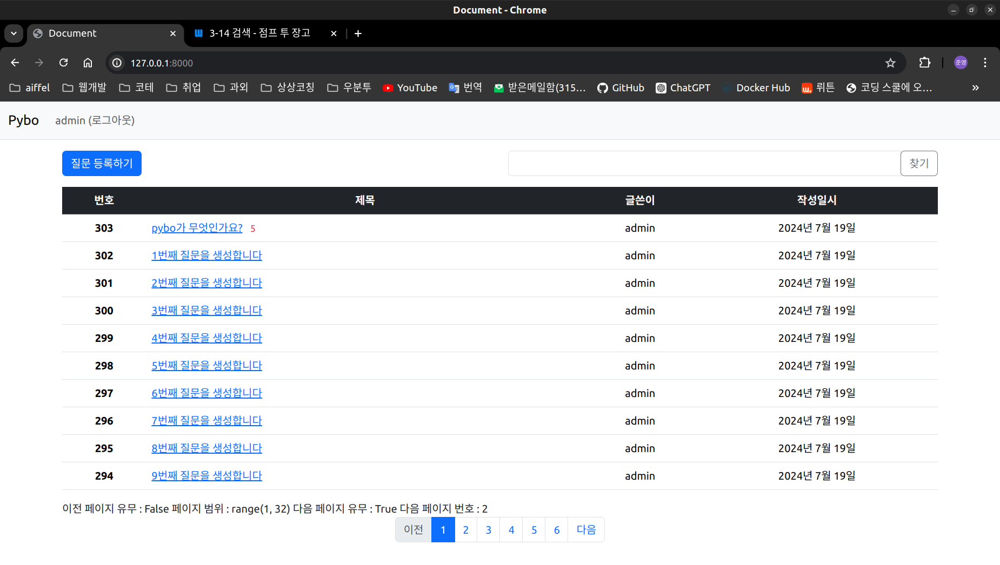
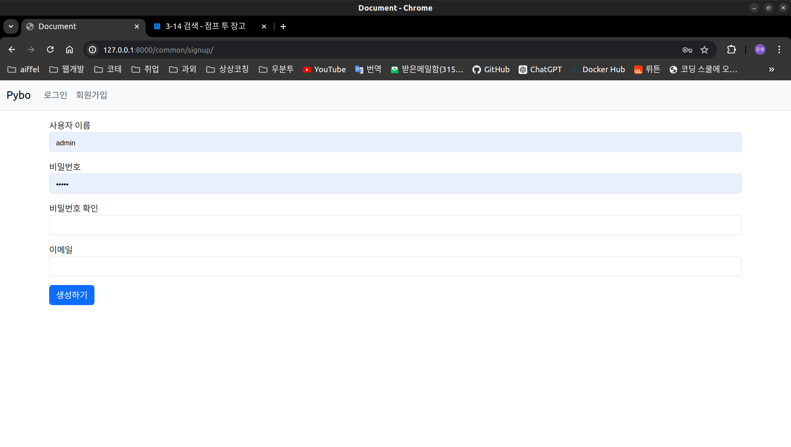

# common 앱 정리

## 로그인, 로그아웃, 회원가입을 위한 앱

### 과정 설명

#### 로그인
- 로그인 버튼을 사용해서 화면이동 -> 아이디 비번 입력하면 (1.유효성 검사, 2.아이디 비번 매칭검사)후 틀리면 폼 리다이렉트, 맞으면 홈화면(index)리다이렉트


#### 로그아웃
- 홈화면에서 로그아웃 버튼 누르면 로그아웃 하고 홈화면 리다이렉트


#### 회원가입
- 홈화면 navbar에서 회원가입 버튼 눌러서 이동 -> 정보입력-> 유효성 검사-> 틀리면 폼 리다이렉트, 맞으면 로그인후 홈 화면 리다이렉트


### urls
```
from django.urls import path
from django.contrib.auth import views as auth_views
from . import views

app_name = "common"

urlpatterns = [
    path(
        "login/",
        auth_views.LoginView.as_view(template_name="common/login.html"),
        name="login",
    ),
    path("logout/", views.logout_view, name="logout"),
    path("signup/", views.signup, name="signup"),
]
```
### views
```
from django.contrib.auth import authenticate, login, logout
from django.shortcuts import render, redirect
from common.forms import UserForm

def logout_view(request):
    logout(request)
    return redirect('index')

def signup(request):
    if request.method == "POST":
        form = UserForm(request.POST)
        # print(f'form : {form}')
        if form.is_valid():
            form.save()
            username = form.cleaned_data.get('username')
            raw_password = form.cleaned_data.get('password1')
            # print(f'form클린 데이터 : {form.cleaned_data}')
            user = authenticate(username=username, password=raw_password)  # 사용자 인증
            # print(f'username:{username}, password:{raw_password}, 인증: {user}')
            login(request, user)  # 로그인
            return redirect('index')
    else:
        form = UserForm()
    return render(request, 'common/signup.html', {'form': form})
```
### forms
```
from django import forms
from django.contrib.auth.forms import UserCreationForm
from django.contrib.auth.models import User


class UserForm(UserCreationForm):
    email = forms.EmailField(label="이메일")

    class Meta:
        model = User
        fields = ("username", "password1", "password2", "email")

```

#### templates
- login.html
```


<div class="container my-3">
    <form method="post" action="">
        
        <input type="hidden" name="next" value="{{ next }}">  <!-- 로그인 성공후 이동되는 URL -->
        
        <div class="mb-3">
            <label for="username">사용자ID</label>
            <input type="text" class="form-control" name="username" id="username"
                   value="{{ form.username.value|default_if_none:'' }}">
        </div>
        <div class="mb-3">
            <label for="password">비밀번호</label>
            <input type="password" class="form-control" name="password" id="password"
                   value="{{ form.password.value|default_if_none:'' }}">
        </div>
        <button type="submit" class="btn btn-primary">로그인</button>
    </form>
</div>

```
- signup.html
```


<div class="container my-3">
    <form method="post" action="">
        
        
        <div class="mb-3">
            <label for="username">사용자 이름</label>
            <input type="text" class="form-control" name="username" id="username"
                   value="{{ form.username.value|default_if_none:'' }}">
        </div>
        <div class="mb-3">
            <label for="password1">비밀번호</label>
            <input type="password" class="form-control" name="password1" id="password1"
                   value="{{ form.password1.value|default_if_none:'' }}">
        </div>
        <div class="mb-3">
            <label for="password2">비밀번호 확인</label>
            <input type="password" class="form-control" name="password2" id="password2"
                   value="{{ form.password2.value|default_if_none:'' }}">
        </div>
        <div class="mb-3">
            <label for="email">이메일</label>
            <input type="text" class="form-control" name="email" id="email"
                   value="{{ form.email.value|default_if_none:'' }}">
        </div>
        <button type="submit" class="btn btn-primary">생성하기</button>
    </form>
</div>

```

#### settings.py
```
# 로그인 성공후 이동하는 URL
LOGIN_REDIRECT_URL = "/"
```
